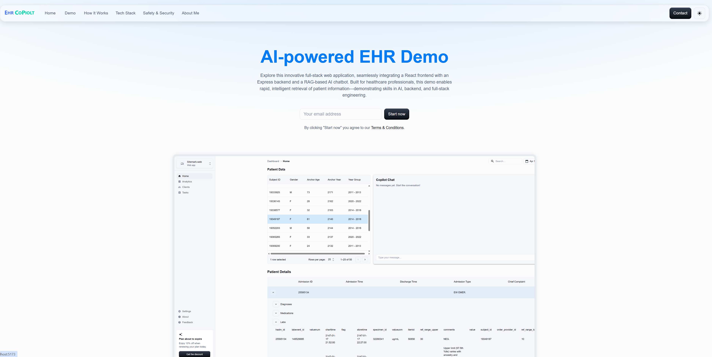
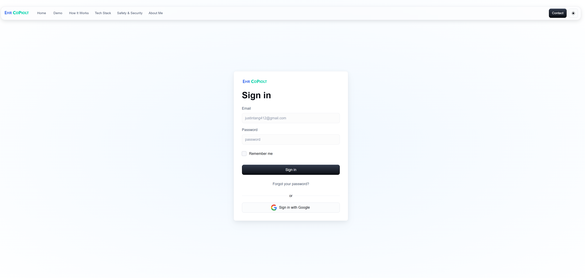
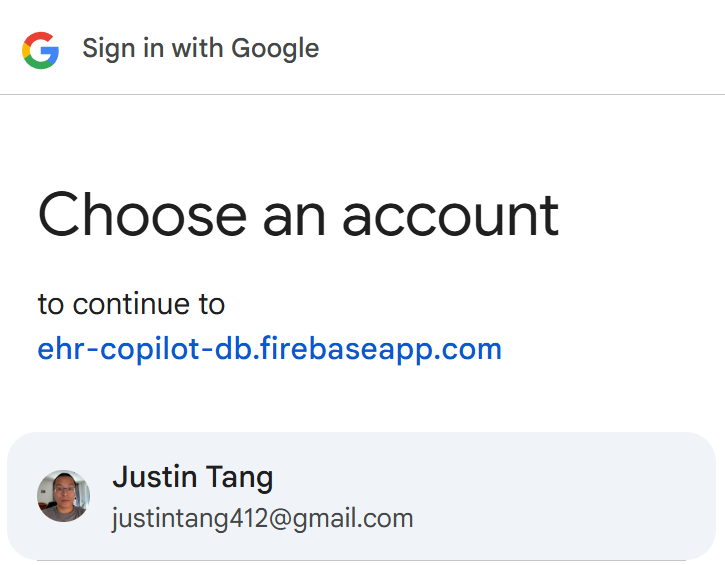

# EHR-CoPilot-App

**EHR-CoPilot: Modern Clinical Intelligence Platform with AI Copilot**

---

## Overview

EHR-CoPilot is a full-stack, production-grade Electronic Health Record (EHR) platform designed to deliver actionable clinical insights and streamline hospital operations. Its core innovation is the **EHR CoPilot**—an AI-powered chatbot that leverages Retrieval-Augmented Generation (RAG), Natural Language Understanding (NLU), and Large Language Models (LLMs) to help clinicians rapidly access and interpret complex patient data.

This project demonstrates my ability to architect, implement, and test a scalable, secure, and modern healthcare application using industry best practices and the latest technologies.

---

## Features

- **AI Copilot Chatbot:** Context-aware, natural language assistant for clinicians, powered by RAG and LLMs.
- **EHR Dashboard:** At-a-glance hospital and patient insights with interactive analytics.
- **Secure Authentication:** Supports both Firebase Auth (JWT) and local session-based login.
- **Patient Management:** View, search, and analyze patient records with robust API endpoints.
- **Role-Based Access Control:** Ensures data privacy and compliance.
- **Production-Ready Stack:** CI/CD, automated testing, code linting, and commit conventions.
- **Component-Driven UI:** Built with Material-UI and Storybook for rapid, accessible development.

---

## Tech Stack

### Frontend

- **React** (TypeScript) & **Vite**: Lightning-fast SPA development.
- **Material-UI (MUI):** Modern, responsive, accessible UI components.
- **React Router:** Client-side routing.
- **Axios:** API client with automatic token handling.
- **Storybook & Chromatic:** Component-driven development and visual regression testing.
- **Jest & React Testing Library:** Unit and integration tests.

### Backend

- **Express.js** (TypeScript): Robust REST API server.
- **Prisma ORM & PostgreSQL:** Type-safe, scalable data layer.
- **Firebase Functions:** Serverless endpoints for patient data and authentication.
- **JWT & bcrypt:** Secure authentication and password hashing.
- **Helmet & CORS:** Security best practices.
- **Morgan:** HTTP request logging.

### DevOps & Tooling

- **ESLint & Prettier:** Code quality and formatting.
- **Husky & lint-staged:** Pre-commit hooks for consistent codebase.
- **Commitlint:** Enforces conventional commit messages.
- **CI/CD Ready:** Easily integrates with modern pipelines.

---

## Architecture

- **Monorepo:** Unified codebase for client, server, and serverless functions.
- **Feature-Based Organization:** Code grouped by domain for scalability.
- **API Layer Abstraction:** Clean separation of data fetching and UI.
- **Custom Hooks:** Reusable logic for maintainable React code.
- **Testing Strategy:** Unit, integration, and E2E tests for reliability.

---

## Getting Started

### Prerequisites

- Node.js (LTS)
- Git
- PostgreSQL (for local DB)
- Firebase account (for cloud functions)

### Installation

```bash
# Clone the repo
git clone https://github.com/YOUR_USERNAME/ehr-copilot-app.git
cd ehr-copilot-app

# Install root dependencies
npm install

# Install server dependencies
cd server && npm install && cd ..

# Install client dependencies
cd client && npm install && cd ..
```

### Environment Setup

- Copy `.env.example` to `.env` in both `server` and `client` directories.
- Fill in required values (DB connection, JWT secret, Firebase config).

### Running Locally

- **Backend:** `cd server && npm run dev`
- **Frontend:** `cd client && npm run dev`
- **Firebase Functions:** `cd functions && npm run serve`

---

## Testing

- **Backend:** `cd server && npm test`
- **Frontend:** `cd client && npm test`

---

## Why This Project?

This project demonstrates my ability to:

- Build secure, scalable, and maintainable full-stack applications.
- Architect modern, cloud-ready solutions for real-world healthcare needs.
- Implement advanced AI/ML features (RAG, LLMs) in production.
- Apply best practices in testing, CI/CD, and code quality.
- Work with modern tools and frameworks used by top tech companies.

---

## Screenshots








---

## Contact

**Justin Tang**  
Justintang412@gmail.com |+1 (647) 612 0176 | Richmond Hill, Ontario, Canada
https://linkedin.com/in/justintang412 | https://github.com/justintang412

---

*Thank you for reviewing my project! I’m excited to bring these skills to your team.*
